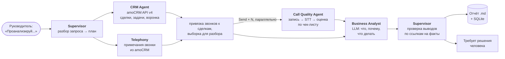

# sales-analyst-agents

Тестовое задание на позицию AI Automation Engineer / AI Agent Developer.

Руководитель пишет: **«Проанализируй работу отдела продаж за последние 30 дней»**. Система сама забирает сделки и задачи из amoCRM, звонки из телефонии, слушает разговоры, сравнивает менеджеров и период с прошлым, находит проблемные сделки и причины отказов, и отдаёт отчёт: что происходит, почему, где проблема и что требует решения человека.

Это не только схема на бумаге — граф агентов реализован и запускается одной командой на демо-данных (фейковый amoCRM API v4 + записи звонков). Пример результата в офлайн-режиме (без LLM, звонки оценены эвристикой): [`reports/example-demo-report.md`](reports/example-demo-report.md).

```bash
pip install -e ".[dev]"
python -m sales_analyst --demo                 # демо-данные; с ANTHROPIC_API_KEY — LLM, без — правила
python -m sales_analyst --demo --offline       # явно без LLM
python -m sales_analyst "Как работал Петров за 2 недели?"   # реальный amoCRM: заполнить .env по .env.example
pytest
```

Ответы на вопросы задания — ниже, по порядку.

---

## 1. Архитектура



Оркестрация — **LangGraph** (`src/sales_analyst/graph.py`): CRM и телефония собираются параллельно, звонки разбираются параллельным fan-out через `Send`, агенты обмениваются только типизированным состоянием (pydantic). Главный принцип: **цифры считает код, LLM интерпретирует**. Таблицы отчёта строятся из метрик, а каждое число в тексте выводов супервизор сверяет с посчитанными фактами.

| Агент | Что делает | Откуда данные | LLM |
|---|---|---|---|
| **Supervisor** | Разбирает запрос в план (период, менеджеры, нужны ли звонки). После аналитика проверяет каждый вывод и собирает список того, что нужно решить человеку | текст запроса | Sonnet, structured output; без LLM — правила: период, «без звонков», фамилии |
| **CRM Agent** | Метрики по менеджерам и отделу за период и за прошлый такой же период: новые, выигранные, проигранные, выручка, доля выигранных, открытые сделки по этапам, причины отказов. Находит сделки без задач и с просроченными задачами | amoCRM API v4: `GET /users`, `/leads/pipelines`, `/leads` (фильтры `created_at`, `closed_at`, `statuses`; `with=loss_reason,contacts`), `/tasks` (`is_completed`, `entity_type`) | нет — чистый код |
| **Call Quality Agent** | Для каждого звонка: скачивает запись, распознаёт, вычищает ПДн, оценивает по чек-листу скрипта (приветствие, выявление потребности, презентация, возражения, следующий шаг — по 0–2), определяет исход и причину отказа словами клиента, ошибки менеджера и уверенность оценки | `GET /{leads,contacts}/notes?filter[note_type][]=call_in,call_out` → `params.link` → запись у провайдера → STT | Sonnet, structured output |
| **Business Analyst** | Сводит CRM и звонки: сравнивает период, менеджеров между собой, связывает причины (низкая конверсия + нет следующего шага в звонках). Каждый вывод обязан ссылаться на факты: `metric:1002.leads_overdue`, `lead:…`, `call:…` | JSON уже посчитанных фактов | Opus, structured output |

**Как обрабатываются звонки.** Метаданные звонков беру не из API конкретной АТС, а из amoCRM: виджет любой телефонии (Mango, UIS, Sipuni, Zadarma, Билайн) пишет примечание `call_in`/`call_out` с длительностью и ссылкой на запись. Так система не привязана к провайдеру — другой провайдер меняет только заголовок авторизации для скачивания записи. Дальше:

1. Звонок привязывается к сделке: напрямую, если примечание в сделке, или через контакт (`with=contacts`). Дубли «контакт + сделка» склеиваются по `uniq`.
2. Звонки короче 60 с (недозвоны, автоответчики) только считаются, но не слушаются. Из остальных берётся выборка до `MAX_CALLS`, поровну на менеджера, свежие первыми — это ограничивает стоимость и делает сравнение честным.
3. Запись → STT через OpenAI-совместимый `/v1/audio/transcriptions` (облачный Whisper или self-hosted faster-whisper в своём контуре). Транскрипт кэшируется: повторный отчёт за тот же период не платит за распознавание.
4. Телефоны, e-mail и номера карт заменяются на `[телефон]`/`[email]`/`[карта]` (имена и адреса регулярками не ловятся — для них нужен NER, например Natasha). Транскрипт уходит в LLM в тегах `<transcript>`, промпт велит считать содержимое данными. Балл 0–100 считает код из чек-листа, а не модель.
5. Ошибка одного звонка (битая ссылка, таймаут STT) не роняет прогон, а попадает в «Требует решения человека». Если не ответила LLM, звонок оценивается эвристикой по ключевым словам с пометкой. Если STT не настроен, звонки считаются по CRM, но не слушаются — отчёт об этом говорит.

**Где хранятся результаты.** SQLite (`DB_PATH`; в проде — та же схема в PostgreSQL): `runs` — запрос, план, метрики, проверка и итоговый отчёт; `transcripts` — кэш распознавания; `call_analyses` — оценка каждого звонка, из неё можно строить динамику по менеджеру от отчёта к отчёту. Отчёт в Markdown — в `reports/`. Аудио не храню, только ссылку у провайдера.

**Устойчивость.** amoCRM: ответ 204 на пустую выборку, пагинация по `_links.next` (до 250 на страницу), троттлинг ниже лимита ~7 запросов/с, повтор на 429 и 5xx с `Retry-After`. Если LLM недоступна, разбор запроса, оценка звонков и выводы строятся правилами, отчёт всё равно выходит — с пометкой. Метод `/users` в amoCRM доступен только администратору: без этих прав менеджеры показываются по ID.

Что ещё нужно до прода — в [`docs/production.md`](docs/production.md): вебхуки amoCRM для распознавания звонков в течение дня, интерфейс (Telegram-бот), PostgreSQL, калибровка чек-листа.

## 2. Что система делает сама, а что передаёт человеку

**Сама:** собирает данные из CRM и телефонии; считает метрики и сравнение с прошлым периодом; находит сделки без задач и с просрочкой; распознаёт и оценивает звонки; сводит причины отказов из CRM и со слов клиентов; пишет выводы и рекомендации; проверяет каждый вывод аналитика — все ссылки должны вести на существующие метрики, сделки и звонки, а все числа в тексте должны быть в посчитанных фактах. Неподтверждённое отбрасывается, и в отчёте видно, что именно и почему.

**Передаёт человеку** (раздел «Требует решения человека» в каждом отчёте):

- **Решения о людях.** Система даёт сигнал «у Петрова половина сделок без контроля», но премии, разборы и кадровые решения принимает руководитель. Серьёзные выводы о сотрудниках помечаются «подтвердить по исходным данным».
- **Судьбу крупных проблемных сделок** — вернуть в работу или закрыть. Система ничего не меняет в CRM: в клиенте amoCRM нет ни одного метода записи.
- **Звонки, где оценка ненадёжна** — уверенность модели ниже 0,6 (плохая связь, обрывки) или отказ клиента при низком балле: их нужно прослушать.
- **Проблемы с данными** — много звонков не привязаны к сделкам, LLM была недоступна, выводы отброшены проверкой.
- **Сам чек-лист скрипта** утверждает руководитель отдела продаж: система оценивает по нему, но не придумывает стандарты.

**Три главных риска и ограничения:**

1. **Качество данных в CRM.** Если менеджеры не ставят причину отказа, ставят задачи «для галочки», а телефония пишет звонки в контакты без сделок, система уверенно проанализирует неполную картину. Что делаю: отчёт показывает «причина не указана» отдельной строкой и долю непривязанных звонков, а первым шагом внедрения стоит аудит гигиены CRM.
2. **Ошибки распознавания и LLM.** STT путает слова и не всегда размечает, кто говорит; модель может уверенно ошибиться в оценке звонка или придумать вывод. Что делаю: все цифры считает код; вывод, у которого ссылка не ведёт на существующий факт или число не совпадает с посчитанным, отбрасывается; оценка звонка несёт `confidence`, ненадёжные уходят человеку; перед запуском чек-лист калибруется на 30–50 звонках, размеченных руководителем. Оценка звонка — сигнал для разбора, а не основание для штрафа.
3. **Персональные данные и юридические рамки.** Записи разговоров содержат ПДн клиентов (152-ФЗ), а отправка их в зарубежный LLM — трансграничная передача, для которой нужны правовое основание и уведомление РКН. Что делаю: телефоны, e-mail и номера карт вычищаются из транскрипта до LLM (имена — следующим шагом, через NER); STT можно держать в своём контуре (self-hosted Whisper); слой LLM абстрагирован (`StructuredLLM`), поэтому Claude меняется на YandexGPT/GigaChat или локальную модель без изменений в агентах.

Ещё ограничения поменьше: лимит amoCRM ~7 запросов/с (на больших аккаунтах первый прогон идёт минуты), стоимость STT и LLM растёт линейно с числом звонков (поэтому выборка и кэш), а сделка, которая месяц стоит на одном этапе, но с задачей на будущее, в проблемные не попадёт — для «застрявших» сделок нужен отдельный критерий по истории смены этапов (`/api/v4/events`).

## 3. Код: сделки без задач или с просроченными задачами

[`snippets/overdue_leads.py`](snippets/overdue_leads.py) — 49 строк, Python + httpx, отдельный файл без зависимостей от остального проекта. Тот же алгоритм внутри системы — `find_problem_leads` в [`crm_agent.py`](src/sales_analyst/agents/crm_agent.py), а полноценный клиент с троттлингом и ретраями — [`sources/amocrm.py`](src/sales_analyst/sources/amocrm.py). Тест гоняет фрагмент против фейкового amoCRM и сверяет результат с агентом.

```python
"""amoCRM API v4: открытые сделки без задач или с просроченными задачами."""
import os
import time

import httpx

CLOSED = {142, 143}  # системные статусы «Успешно реализовано» и «Закрыто и не реализовано»


def fetch_all(client: httpx.Client, path: str, key: str, params: dict) -> list[dict]:
    items, page, retries = [], 1, 0
    while True:
        resp = client.get(path, params={**params, "limit": 250, "page": page})
        if resp.status_code == 429 and retries < 5:  # лимит ~7 запросов/с; после 5 попыток — ошибка
            retries += 1
            time.sleep(2**retries)
            continue
        if resp.status_code == 204:  # пустая выборка приходит как 204 без тела
            return items
        resp.raise_for_status()
        data = resp.json()
        items += data["_embedded"][key]
        if "next" not in data.get("_links", {}):
            return items
        page, retries = page + 1, 0


def problem_leads(subdomain: str, token: str, now: float | None = None) -> dict[str, list[dict]]:
    now = time.time() if now is None else now
    headers = {"Authorization": f"Bearer {token}"}
    with httpx.Client(base_url=f"https://{subdomain}.amocrm.ru/api/v4", headers=headers, timeout=30) as client:
        pipelines = fetch_all(client, "/leads/pipelines", "pipelines", {})
        open_stages = [(p["id"], s["id"]) for p in pipelines for s in p["_embedded"]["statuses"] if s["id"] not in CLOSED]
        status_filter = {f"filter[statuses][{i}][{k}]": v for i, (pipeline_id, status_id) in enumerate(open_stages)
                         for k, v in (("pipeline_id", pipeline_id), ("status_id", status_id))}
        leads = fetch_all(client, "/leads", "leads", status_filter)  # только сделки на открытых этапах
        tasks = fetch_all(client, "/tasks", "tasks", {"filter[entity_type]": "leads", "filter[is_completed]": 0})
    earliest: dict[int, int] = {}  # самый ранний срок открытой задачи по каждой сделке
    for t in tasks:
        earliest[t["entity_id"]] = min(t["complete_till"], earliest.get(t["entity_id"], t["complete_till"]))
    return {
        "without_tasks": [lead for lead in leads if lead["id"] not in earliest],
        "overdue": [lead for lead in leads if earliest.get(lead["id"], now) < now],
    }


if __name__ == "__main__":
    for kind, leads in problem_leads(os.environ["AMOCRM_SUBDOMAIN"], os.environ["AMOCRM_TOKEN"]).items():
        print(f"{kind}: {len(leads)}", [(lead["id"], lead["name"], lead["responsible_user_id"]) for lead in leads[:20]])
```

Почему так:

- Два списочных запроса с пагинацией вместо запроса задач по каждой сделке: на 2 000 открытых сделок это около десятка запросов, а не 2 000.
- Открытые сделки выбираются фильтром `filter[statuses]` по всем незакрытым этапам всех воронок — закрытая история аккаунта не выкачивается.
- «Просроченная» — сделка, у которой самая ранняя открытая задача уже в прошлом. На поле сделки `closest_task_at` не опираюсь: по нему не видно, сколько у сделки задач и есть ли среди них просроченные.
- 429 повторяется с нарастающей паузой не больше пяти раз, дальше — ошибка: бесконечный ретрай на лимите amoCRM заканчивается блокировкой IP.
- `now` можно передать снаружи — так фрагмент детерминированно тестируется.

## 4. Мой AI-проект

См. [`docs/ai-project.md`](docs/ai-project.md) — Workbit, платформа для соискателей с AI-интервьюером.

---

## Структура

```
src/sales_analyst/
  graph.py              граф LangGraph: узлы, параллельные ветки, fan-out звонков
  agents/
    supervisor.py       разбор запроса, проверка выводов, эскалация человеку
    crm_agent.py        метрики и проблемные сделки (без LLM)
    call_quality.py     звонки: выборка, запись, STT, оценка (LLM или эвристика)
    analyst.py          сводный анализ (LLM или правила)
  sources/
    amocrm.py           клиент amoCRM API v4: пагинация, 204, 429, троттлинг
    telephony.py        скачивание записей, STT, вычистка ПДн
  prompts/              промпты агентов (отдельно от кода)
  report.py             сборка отчёта: все таблицы — из метрик, не из LLM
  storage.py            SQLite: прогоны, транскрипты, оценки звонков
  demo/                 фейковый amoCRM на httpx.MockTransport + транскрипты
snippets/overdue_leads.py   ответ на пункт 3
tests/                  клиент amoCRM, агенты, сквозные прогоны графа, фрагмент
```

В демо работает настоящий клиент amoCRM — подменяется только сеть: фейковый сервер отвечает в формате API v4, отдаёт 204, страницы и один 429, чтобы были видны ретраи. Тесты прогоняют граф целиком: без LLM, с фейковой LLM, которая «выдумывает» вывод (проверка его отбрасывает), с упавшей LLM и без STT — во всех случаях отчёт строится.
